# 🛡 SİBER GÜVENLİK 3.0 ULTRA

**Üstad Kenan Kuzucu — savunma amaçlı siber güvenlik merkezi**
Tek dosyada çalışan, çevrimdışı da açılan, 50 bölümlü kent-ölçeğinde siber güvenlik ve günlük hayat paneli.

🌐 **Canlı site:** <https://www.ustadcyber.com.tr/>

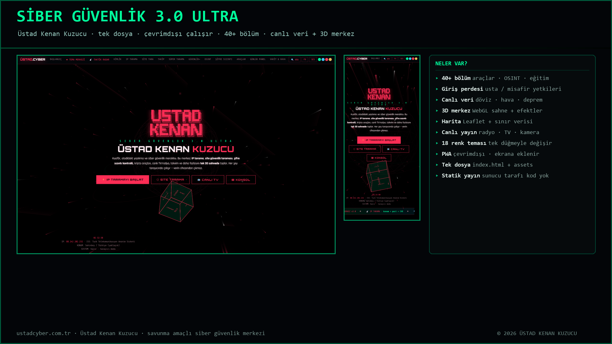

---

## 📌 Bu depo nedir?

`www.ustadcyber.com.tr` sitesinin **tam kaynak yedeği**. Depoda üç katman birlikte durur:

| Katman | İçerik |
|---|---|
| **Canlı sürüm** | Sunucudan indirilen, birebir doğrulanmış site (kök dizindeki `index.html` + `assets/`) |
| **Yerel sürüm** | Bilgisayardaki **daha yeni** sürüm (`surum-yerel/index.html`) — sunucuya henüz yüklenmemiş |
| **Geçmiş** | 14 adet tarihli `index-*-YEDEK.html` (v4.0'dan bugüne) |

Ayrıca: ekran görüntüleri, yerel motor, Word belgeleri ve cPanel'e yüklemeye hazır temiz ZIP.

| Bilgi | Değer |
|---|---|
| Site | SİBER GÜVENLİK 3.0 ULTRA |
| Sahibi | Üstad Kenan Kuzucu |
| Canlı `index.html` | 843.164 bayt · sha256 `e6eff9fddd95d04d…` |
| Yerel yeni sürüm | 849.117 bayt · sha256 `19269fb974252610…` |
| Bölüm | 50 (`section`) · 160 araç kartı · 222 düğme |
| Renk teması | 18 |
| Teknoloji | Tek dosya HTML + CSS + JS · Leaflet (harita) · hls (canlı yayın) · Service Worker (PWA) |
| Yedek tarihi | 23 Eylül 2026 |

---

## 🖼 Ekran görüntüleri

<table>
<tr>
<td width="50%"><b>Güvenli giriş perdesi</b><br>3D sahne + usta/misafir girişi<br>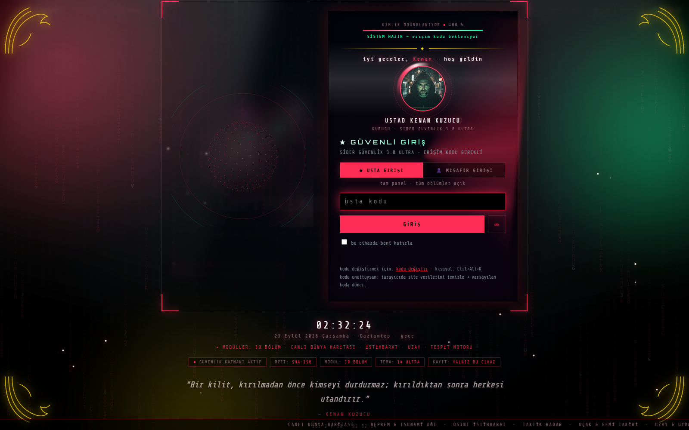</td>
<td width="50%"><b>Ana sayfa</b><br>Hero, konsol ve durum şeridi<br>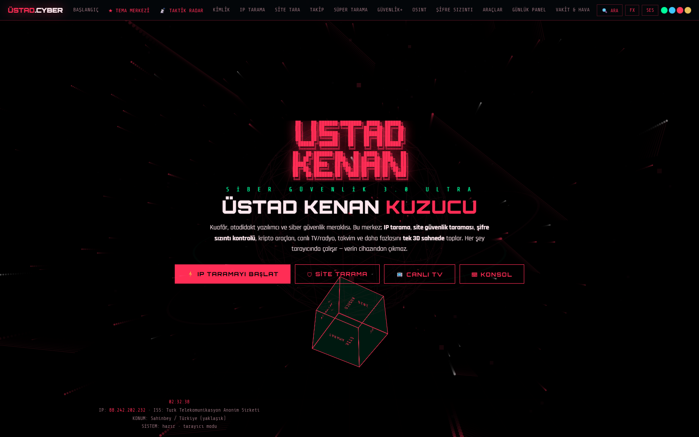</td>
</tr>
<tr>
<td width="50%"><b>Kripto Araç Kutusu</b><br>Şifre üretici, hash, DNS sorgu, kodlama<br>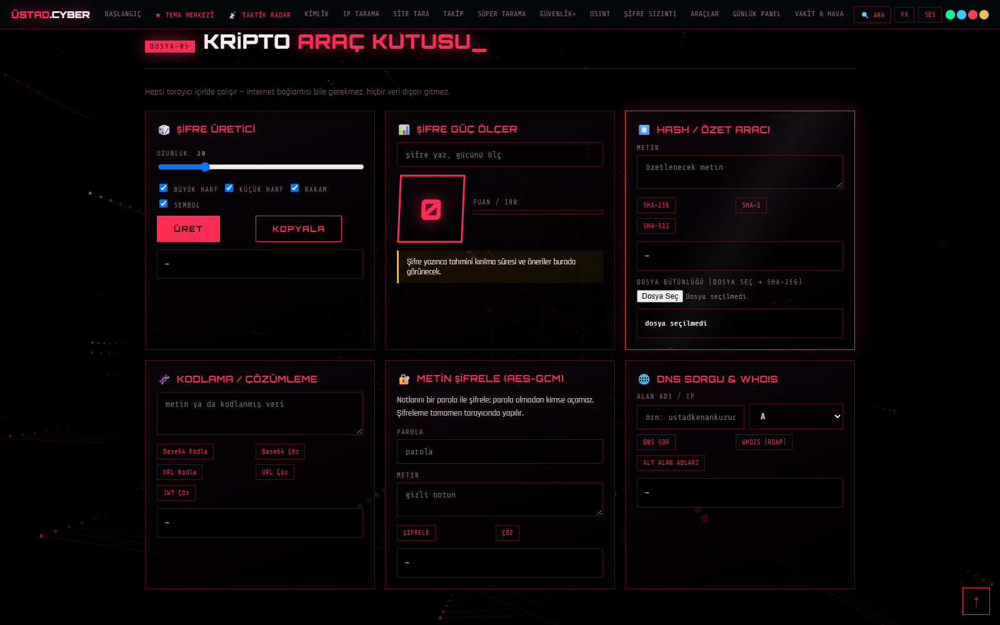</td>
<td width="50%"><b>OSINT ve Araç Merkezi</b><br>Açık kaynak istihbarat araçları<br>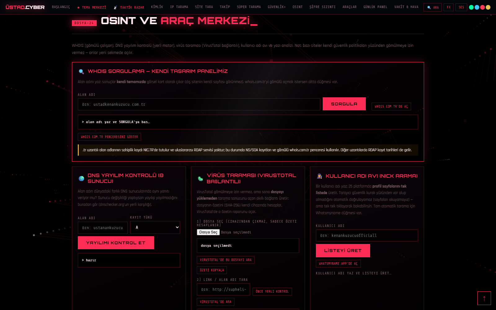</td>
</tr>
<tr>
<td width="50%"><b>Canlı Dünya Haritası</b><br>Leaflet + ülke sınır verisi<br>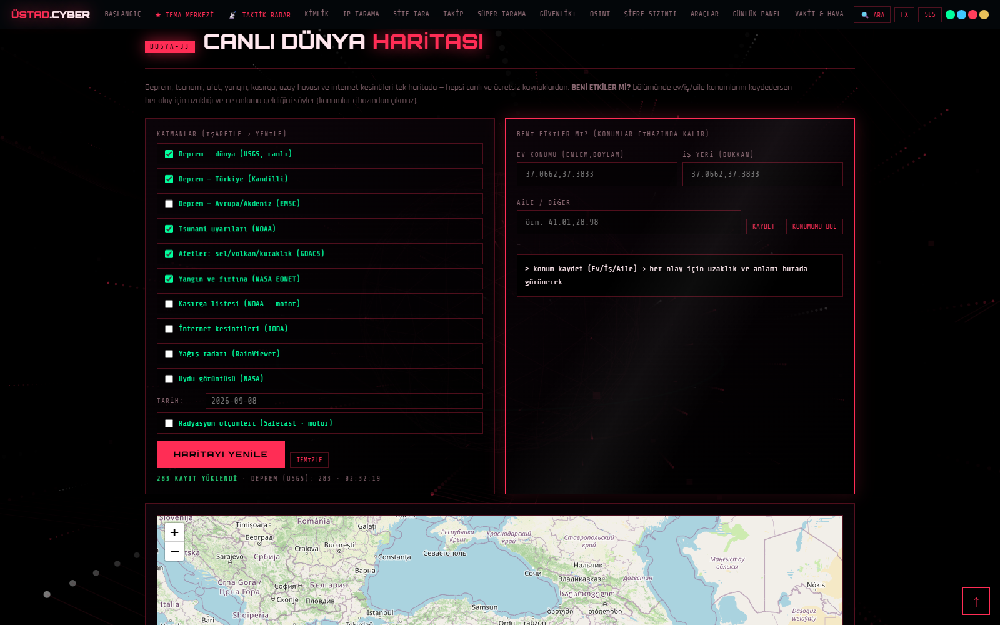</td>
<td width="50%"><b>Tema Merkezi</b><br>18 renk teması + 3D efekt kontrolü<br>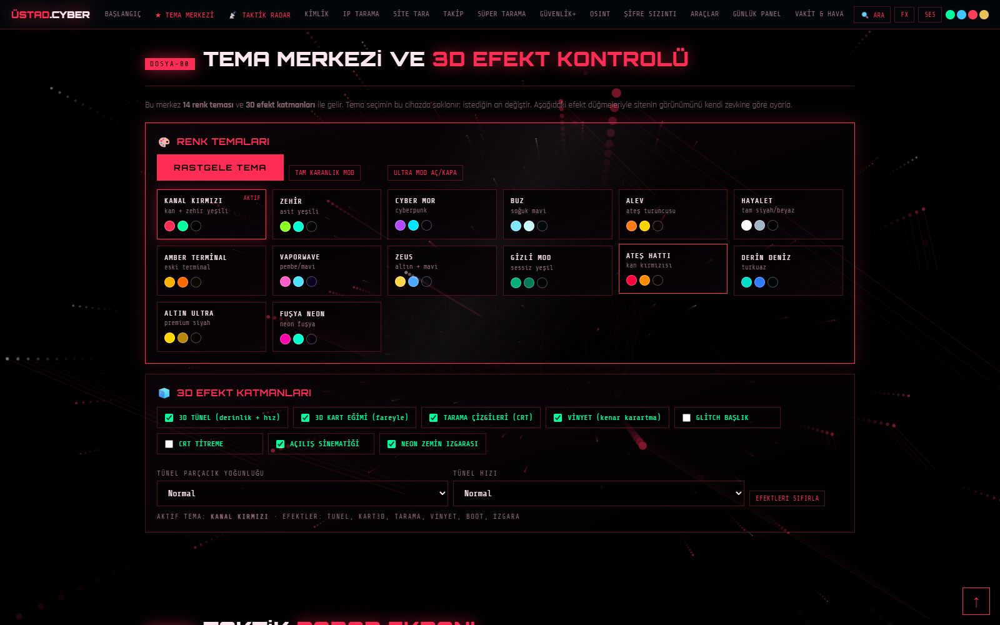</td>
</tr>
<tr>
<td width="50%"><b>Canlı yayın</b><br>TV odası + radyo istasyonu<br>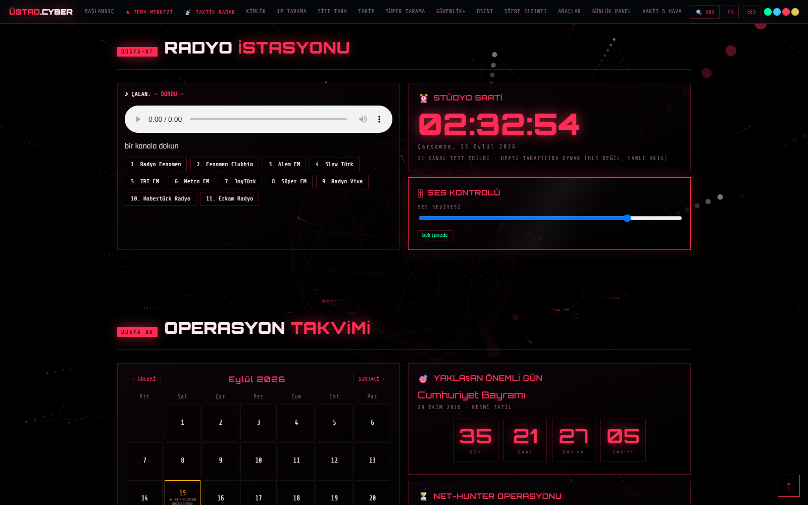</td>
<td width="50%"><b>Oyun ve Deneyim Odası</b><br>Zeka oyunları, satranç saati, bilmece<br>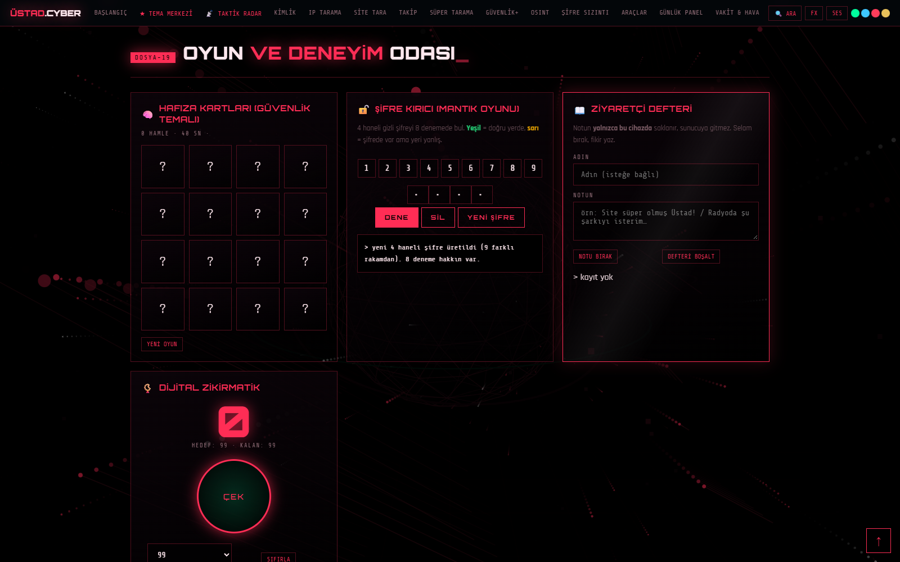</td>
</tr>
<tr>
<td width="50%"><b>Mobil görünüm</b><br>Telefonda tek sütun<br>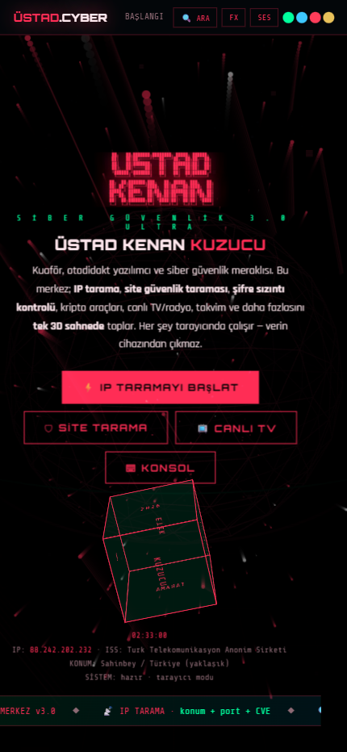</td>
<td width="50%"><b>18 tema</b><br>Aynı sayfa, on sekiz renk düzeni<br>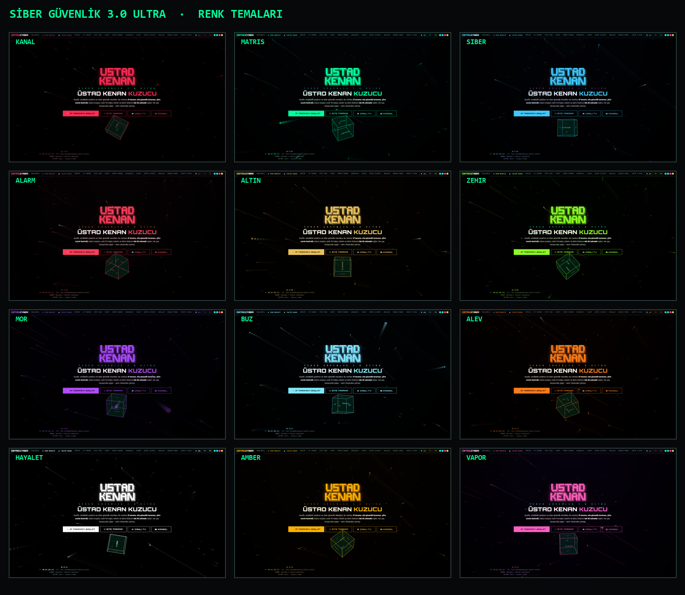</td>
</tr>
</table>

---

## ✨ Sitede neler var? (50 bölüm)

**Güvenlik araçları**
IP Tarama Merkezi · Site Güvenlik Taraması · Şifre Sızıntı Kontrolü · Şifre Üretici ve Güç Ölçer ·
Hash / Özet Aracı · DNS Sorgu ve WHOIS · Kodlama / Çözümleme · Metin Şifreleme (AES‑GCM) ·
Etik Hacker Araç Kutusu · Süper Tarama Odası · Tarama Takip Listesi · Bilgisayar Sağlık Kontrolü · Güvenlik Ekstraları

**OSINT ve istihbarat**
OSINT ve Araç Merkezi · OSINT Ekleri · Hedef İstihbaratı · Kimlik ve Fotoğraf İstihbaratı ·
Canlı Uçak ve Gemi Radarı · Uçak ve Gemi İstihbaratı · Tespit Motoru ve Bildirim

**Canlı veri**
Taktik Radar Ekranı · Canlı Saldırı Odası · Canlı Dünya Haritası · Uzay, Uydu ve Kamera ·
Hava Kalitesi ve Toz Taşınımı · 7 Günlük Tahmin ve Don Uyarısı · Yıldırım Radarı ·
Ulaşım ve Yörünge Radarı · İstanbul Raylı Sistem · Piyasa: Altın ve Gümüş · Dünya Durumu: Savaş ve Ekonomi ·
İnternet Hız Testi · Vakit ve Hava Merkezi · Güneş ve Ay Paneli

**Günlük hayat**
Operasyon Takvimi · Önemli Günler Takvimi · 3D Saat Kulesi · Günlük Hayat Paneli ·
Üstad Salon Kenan · Salon Ekstraları · Vatan ve Bayrak · Müzik ve Ses Odası · Canlı TV Odası · Radyo İstasyonu

**Oyun ve deneyim**
Oyun ve Deneyim Odası · Sudoku ve Hafıza Oyunu · Satranç Saati · Zar / Tura / Kura · Günün Bilmecesi ve Türkiye Bilgi Yarışması

**Diğer**
Siber Akademi · Komut Konsolu · Kimlik Kartı · İletişim ve Selam

---

## 🔧 Öne çıkan özellikler

- **Tek dosya mimarisi** — sitenin tamamı `index.html` içinde; yanında yalnız `assets/` (harita kütüphanesi, sınır verisi, fotoğraf, simge).
- **Güvenli giriş perdesi** — 3D sahneli açılış; **USTA GİRİŞİ** ve **MİSAFİR GİRİŞİ** olmak üzere iki seviye.
  Misafir oturumunda seçilen bölümler gizlenir, ayarı `misafir-ayar.txt` dosyasından okur.
- **18 renk teması** — `data-tema` özniteliğiyle anında değişir; "rastgele tema", tam karanlık mod ve ultra mod düğmeleri vardır.
- **PWA** — `manifest.json` + `sw.js`; telefonda "Ana ekrana ekle" ile uygulama gibi açılır, çevrimdışı çalışır.
- **Canlı yayın** — hls.js ile TV, `<audio>`/iframe ile radyo; harita için Leaflet.
- **Efekt katmanı** — tünel, tilt, tarama çizgileri, vignette, glitch, 3D küp; FX ve ses düğmeleriyle kapatılabilir.
- **Sır barındırmaz (yayın kopyasında)** — giriş parolası sayfa içinde düz metin olarak tutulmaz.

---

## 📁 Klasör yapısı

```
├── index.html                 CANLI sürüm (sunucudan indirilen, sha256 doğrulandı) 843 KB
├── manifest.json  sw.js       PWA: uygulama bilgisi + çevrimdışı önbellek
├── robots.txt  .htaccess      yayın kuralları ve güvenlik başlıkları
├── misafir-ayar.txt           misafirin göremeyeceği bölümler (parola yorumu ÇIKARILDI)
├── assets/                    leaflet.js/css · dunya-ulke.geojson · foto/ · icons/ · galeri/
├── surum-yerel/index.html     bilgisayardaki DAHA YENİ sürüm (sunucuya çıkmamış) 849 KB
├── gecmis-surumler/           14 tarihli yedek: v4.0 · v4.1 · KİLİT öncesi · KOD DEĞİŞTİR öncesi…
├── motor/engine.py            yerel motor (Python) + BASLAT-MOTOR.bat + OKU-BENI.txt
├── belgeler/                  7 Word belgesi: site envanteri, 3D merkez rehberi, final rapor, bekleyen işler…
├── ekranlar/                  kapak + 10 ekran görüntüsü
├── yukleme/USTADCYBER-YUKLE.zip  cPanel'e yüklemeye hazır paket (26 dosya, parolasız)
└── .canli-surum.json          canlıdan indirilen her dosyanın boyutu ve sha256 özeti
```

---

## 🚀 Sunucuya yayınlama (cPanel)

1. cPanel → **Dosya Yöneticisi** → sitenin kök klasörüne gir.
2. `yukleme/USTADCYBER-YUKLE.zip` dosyasını yükle → sağ tık → **Extract**.
   (ZIP'in kökünde doğrudan `index.html` vardır; ek klasör oluşmaz.)
3. `.htaccess` dosyası gizlidir (nokta ile başlar): Dosya Yöneticisi → **Settings → Show Hidden Files**.
4. cPanel → **SSL/TLS Status** → **Run AutoSSL** (yeşil kilit).
5. Telefonda siteyi aç, **CANLI YAYIN** ve harita bölümünü dene, sonra "Ana ekrana ekle".

> Yükleme sonrası tarayıcı önbelleği yüzünden eski sayfa görünebilir: `Ctrl + F5`.

---

## ⚠️ Güvenlik notları (dürüst)

1. **Parola yorumu canlıda açık:** `https://www.ustadcyber.com.tr/misafir-ayar.txt` adresi herkese açık servis ediliyor ve
   dosyanın yorum satırında usta giriş parolası yazıyordu. Bu depodaki kopya **temizlenmiştir**.
   Öneri: sunucudaki dosyayı da yorumsuz sürümle değiştir (dosyanın ilk satırı yeterlidir).
2. **Tarayıcı tarafı perde gerçek koruma değildir:** sayfa kaynağını görüntüleyen biri gizli bölümlerin içeriğine ulaşabilir.
   Gerçek gizlilik gerekiyorsa: içeriği şifreleme, cPanel **Directory Privacy** (.htpasswd) veya sunucu tarafı oturum kullanılmalı.
3. **Bu depoda bilerek YOK:** parola/kimlik dosyaları (`SUNUCU-SIFRE-KORUMASI.txt`, `.htpasswd`, `dizin-sifresi-htaccess.txt`),
   eski yükleme ZIP'leri (içlerinde parola dosyası vardı) ve `motor/motor.log`.
   Bunlar bilgisayardaki `www.ustadcyber.com.tr/SIFRELI-BILGISAYARDA-KALSIN` klasöründe durur.
4. **Bu depoyu herkese açık tutmak** siteyi ayrıca riske atmaz: site zaten herkese açık servis ediliyor ve kaynağı tarayıcıdan görülebiliyor.
   Yine de isterseniz depo gizli (private) yapılabilir — o durumda GitHub Pages önizlemesi kapanır.

---

## 👤 Künye

**ÜSTAD KENAN KUZUCU** · savunma amaçlı siber güvenlik merkezi
Gaziantep / Şehitkamil · erkek kuaförü "ÜSTAD SALON KENAN"
🌐 <https://www.ustadcyber.com.tr/> · © 2026 Üstad Kenan Kuzucu

*Bu depo, sitenin tam kaynak yedeğidir; her bölüm kendi düğmesi, kendi rengi ve kendi 3D sahnesiyle gelir.*
